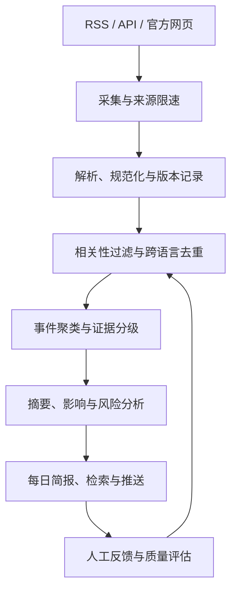

# 系统设计建议

## 1. 设计目标

系统不是“把网页抓下来再让大模型总结”，而是一条可追溯的数据管道。任何简报结论都应能定位到来源、原文时间、抓取时间、原始链接、内容版本和分析模型版本。



## 2. Agent 与确定性组件的边界

| 组件 | 是否使用 LLM | 主要职责 | 失败策略 |
|---|---:|---|---|
| Source Scheduler | 否 | 调度、限速、重试、条件请求 | 退避，不阻塞其他来源 |
| Feed/API Collector | 否 | RSS/API 拉取、保存响应元数据 | 保存错误与状态码 |
| HTML Extractor | 优先否 | 正文、作者、日期、canonical URL 提取 | 选择器失败转通用提取器；不自动上浏览器 |
| Normalizer | 否 | URL、时间、语言、字符与来源标准化 | 标记缺失字段 |
| Relevance Agent | 可选 | 气候相关性、主题多标签、排除歧义 | 低置信进入人工/延迟队列 |
| Dedup & Event Agent | 混合 | URL/指纹确定性去重，embedding 辅助跨语言事件聚类 | 不确定时保留多篇并建立候选簇 |
| Evidence Agent | 是 | 区分官方事实、媒体报道、观点、预测与模型推断 | 证据不足时显式输出不确定 |
| Summary Agent | 是 | 中文标题、要点、事实摘要与多源合并 | 必须带 article/event 引用 ID |
| Decision Support Agent | 是 | 影响对象、时间尺度、风险/机会、待跟踪事项 | 禁止输出无来源的确定性建议 |
| Publisher | 否 | Markdown/HTML/邮件/微信等推送 | 幂等 delivery_key 防重复 |

## 3. 推荐数据流

1. **发现**：RSS/API 或低频列表页得到 URL、标题、时间和短摘录。
2. **规范化**：去除 UTM 等跟踪参数，解析 canonical URL；原始时间和 UTC 时间同时保留。
3. **回源**：只有来源配置允许且正文确有必要时，才请求文章页。
4. **粗过滤**：关键词召回 + 排除词；保留召回原因。
5. **相关性分类**：输出 `is_climate_relevant`、主题、多语言实体和置信度。
6. **去重**：URL hash → 标题规范化 hash → SimHash → embedding/事件级聚类。
7. **证据分级**：官方原始文件/机构声明、同行评议研究、专业媒体、通讯社、综合媒体、倡议组织、搜索聚合分别建模。
8. **分析**：事实摘要、关键数字、利益相关方、政策阶段、风险/机会、未来 24 小时/7 天需跟踪事项。
9. **发布**：每日简报先写文件和数据库，再由推送通道读取，避免分析与推送强耦合。

## 4. 建议技术栈

- Python 3.12 + FastAPI；后台任务初期用 APScheduler，规模增大后再用 Celery/RQ。
- PostgreSQL 16 + pgvector；Redis 负责限速、任务队列与短期缓存。
- `httpx`、`feedparser`、`trafilatura`、`selectolax`；Playwright 仅用于条款允许且无其他方式的动态公开页面。
- SQLAlchemy 2 + Alembic；Pydantic v2 定义统一数据合同。
- MinIO 或本地文件系统保存允许留存的原始响应，数据库只存路径、哈希和权限状态。
- OpenTelemetry/结构化 JSON 日志；Prometheus 可在二期加入。

## 5. 核心数据合同

统一解析器至少输出：

```text
source_id, source_url, canonical_url, title, subtitle, authors,
published_at_raw, published_at_utc, updated_at_utc, fetched_at_utc,
language, country_mentions, organization_mentions, summary_from_source,
body_text_or_null, content_hash, rights_status, extraction_method,
parser_version, raw_snapshot_path_or_null
```

任何字段未知时使用 `null`，不要用空字符串、`unknown` 或猜测值混用。

官方档案使用独立数据合同，避免把正式文件当作普通新闻：

```text
kind, party, title, symbol, body, session, cop_number, version, status,
publication_date, publication_date_precision, language, detail_url, file_url,
source_dataset, source_sha256, imported_at, metadata
```

- NDC 的每个提交版本单独成行，`Active / Archived` 不覆盖历史版本。
- 二手公开数据集只能作为传输镜像；权威链接必须回到 `unfccc.int`，并记录镜像 URL 与导入校验结果。
- COP 决定分“完整注册表覆盖”与“人工核验关键索引”两种范围，界面和文档不得混称。
- 综合报告中的数字进入 `official_metrics`，必须同时保存样本范围、时间窗、局限和官方文件链接。

## 6. 去重与事件聚类

- 第一级：canonical URL 与规范化 URL 的 SHA-256，完全重复直接合并抓取记录。
- 第二级：规范化标题 + 发布日 + 来源域，处理移动端/打印页/语言参数重复。
- 第三级：正文 SimHash，识别通讯社转载和轻度改写；保留首发来源与转载关系。
- 第四级：多语言 embedding + 时间窗口 + 实体重叠形成事件簇。不要把“同一议题”误聚为“同一事件”。
- 每个事件簇保留 `representative_article_id`、支持来源数、独立来源数、官方来源数和观点多样性。

## 7. 简报结构

每日中文简报建议固定为：

1. 今日最重要的 3–5 个事件。
2. COP31 / 国际谈判进展。
3. 政策与监管。
4. 气候融资与市场。
5. 科学与极端天气。
6. 技术与能源转型。
7. 中国与土耳其重点观察。
8. 风险、机会与未来 7 天跟踪清单。
9. 数据覆盖与不确定性说明。

每个事件必须显示来源链接、发布时间、独立来源数和置信度。事实、观点和系统判断分段呈现。

## 8. COP31 专项模式

- 2026-10-15 至 2026-11-30 启用 `conference_mode`。
- 核心源轮询 15–30 分钟：COP31、UNFCCC、UN News、土耳其主管机构、Climate Home、Carbon Brief、Anadolu Agency。
- 额外实体：主席国团队、谈判主席、High-Level Champions、资金机制、NDC、Global Stocktake、Article 6、Loss and Damage、Just Transition。
- 日程变更、官方文件版本和谈判文本必须做页面/文件哈希，避免覆盖历史版本。

## 9. 质量指标

- 采集成功率、24 小时来源覆盖率、发布时间延迟、解析字段完整率。
- 精确重复率、事件簇纯度、跨语言召回率。
- 气候相关性 Precision/Recall；摘要事实一致率；数字/单位抽取准确率。
- 简报引用覆盖率、无来源断言数、人工纠错率、重复推送数。
- 每个指标按来源、语言、主题和日期分层，不能只看总体平均值。
